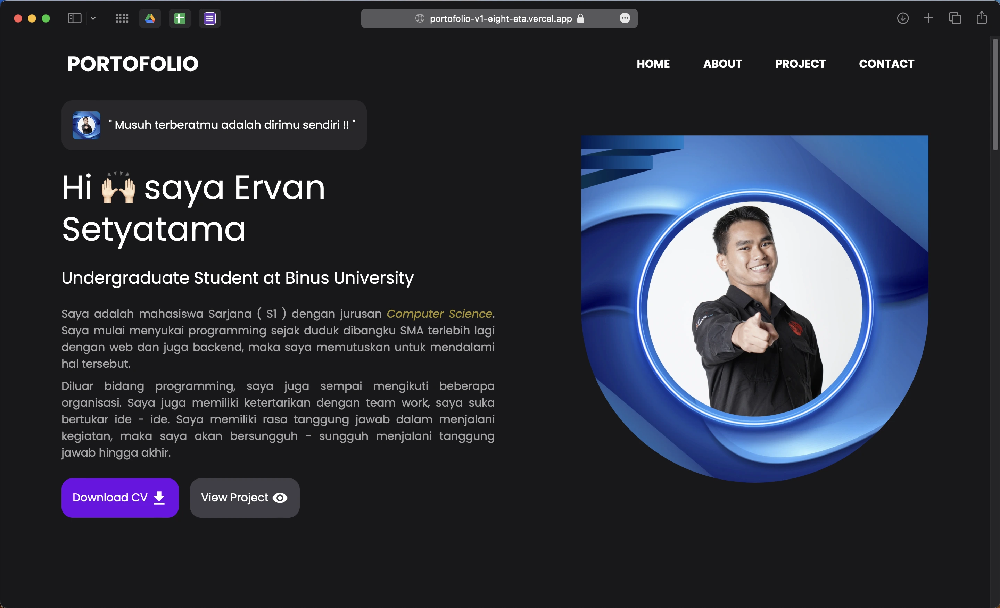

# PORTOFOLIO-V1

A personal portfolio website built with React, TypeScript, and TailwindCSS. This project showcases my skills, projects, and experience.

## Deployment

    

    <a href="https://portofolio-v1-eight-eta.vercel.app/">
        Deploy in this link
    </a>

 

## Features and Functionality

*   **Responsive Design:** The website is designed to be responsive and accessible on various devices.
*   **Navigation:** Easy navigation through different sections of the portfolio using a responsive navbar.
*   **Hero Section:** A compelling introduction with a brief description and links to download CV and view projects.
*   **About Me Section:** Detailed information about my background, skills, and experience.
*   **Tools Section:** A showcase of the technologies and tools I use.
*   **Projects Section:** A display of the projects I have worked on, including descriptions, technologies used, and links to live demos or code repositories.
*   **Footer:** Contact information and links to my social media profiles.
*   **Preloader:** A loading screen displayed while the application initializes.
*   **Error Page:** A basic error page is rendered at the `/error` route, indicating that the page is under development.

## Technology Stack

*   **React:** A JavaScript library for building user interfaces.
*   **TypeScript:** A typed superset of JavaScript that compiles to plain JavaScript.
*   **Tailwind CSS:** A utility-first CSS framework for rapidly styling HTML elements.
*   **React Router DOM:**  For handling navigation between different "pages" or sections within the application.
*   **Vite:**  A build tool that provides a fast and efficient development experience.
*   **AOS (Animate On Scroll):** Library to animate elements as you scroll down.
*   **Framer Motion:** A production-ready motion library for React. In particular, used for animations in the `ResponsiveNavbar` component.

## License Information

This project has no specified license. All rights are reserved.

## Contact/Support Information

For questions or support, please contact me at:

*   Email: ervan.setyatama@binus.ac.id
*   GitHub: [https://github.com/Erpan11400](https://github.com/Erpan11400)
*   LinkedIn: [https://www.linkedin.com/in/ervan-setyatama](https://www.linkedin.com/in/ervan-setyatama)
*   Line: [https://line.me/ti/p/QOdcAl_DUm](https://line.me/ti/p/QOdcAl_DUm)